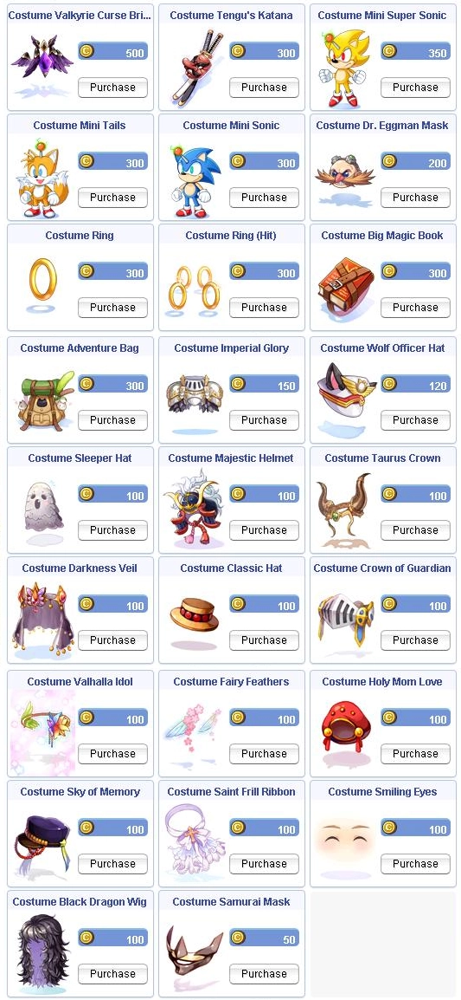

# 📝 **Patch Notes - 10 April 2025**

---

## 🧪 **New Dungeon!**

### 🔬 Biolabs 4 Dungeon
- Initial release of mobs/MVPs and loot tables  
- Exchange NPC soon to follow with various items — save your **`Chill`** and **`Thirst`** that drop from mobs!  
- **Wolfchev Laboratory instance coming soon**

---

## ⚔️ **Battlegrounds**

### ⚙️ Engine
- Enabled **all class types** to split duplicates for team balancing  
- Badge rewards adjusted for each mode:

    ```
    - TG:       12 / 6 / 8
    - Flavius:  15 / 7 / 9
    - KvM:      11 / 5 / 7
    - TDM:      15 / 7 / 9
    - Rush:     18 / 9 / 11
    ```

### 🚀 Rush
- Removed the **first two map segments** of each map to minimize downtime between battles

### 🐞 BG Bug Fixes
- Foods no longer disappear upon **KvM match start**
- When dead within KvM, you no longer **accrue AFK time**
- **Self Dispell** now works when joining BG modes late
- **BG Converters** no longer remain after weapon swaps or strip
- **Box of Sunlight** now correctly tracks teammates/enemies for its entire duration
- BG and regular food effects **no longer stack** within BG modes

---

## 🏰 **Old Glast Heim**

- Minimum level to enter raised to **`95`**
- Mob EXP rates reduced by approximately **`25–30%`**
- Edited mob spawn rates on **floor 2** to increase traffic
- **New Barter NPC** added to exchange MVP drop **"Ancient Golden Coin"** (`0.09%`) for a slotted stat **Temporal Boot**

!!! info "New loot flow:"
    Save Ancient Golden Coins — trade them in directly for boots!

- Removed possibility to **teleport into portals**
- Fixed stats display on **Temporal Agi Boot[0]**, now matches actual bonuses

---

## 💡 **Quality of Life Additions / Edits**

### 🔁 `@restock` / `@restockconfig`
- **3 configurable lists** (can be toggled on/off)  
- Works under **`90%` weight** (current or target %)  
- Limitations:
  - Must be used **within a Kafra (Card or NPC)**  
  - Only works **inside towns**
- Pulls directly from storage to restock items to preset quantities

### 🌱 Branch Room
- NPC now **automatically assigns rooms**
- Room **duration can be extended**
- Remaining time now shown **above the Room NPC**
- Rooms left **empty for 10+ minutes** will auto-reset

### 🐾 `@autofeed`
- Persists through logout  
- **Account-wide**, based on your setting

### 🎭 Costume Conversion NPC
- Now supports **refined headgears**  
!!! warning "Refine will be removed. Converted items will **lose their refine rate**."
- Removes **level requirements** and **weight**

---

## ⚔️ **PvP / Misc Improvements**

- **Izlude PvP Arena** now allows **BG consumables**
- `@whobuy` and `@whosell` outputs now use **comma formatting** for large values (e.g. `1,000,000`)
- Control Panel now shows **in-game item names** instead of **Aegis names**
- **Super Novice Link gear** (headgears, level 4 weapon types) now **persists through logout**
- Kafra Guild Storage message behavior improved to **prevent hanging windows**
- **Repair NPCs** added near new **WoE Controller signs**

---

## 🎁 **Item Changes / Additions**

- **Abandoned Teddy Bear Card** now yields **`+20% SP`**
- **Bradium Brooch** added to **Bradium Golem loot table** at **`0.05%`**

---

## 👗 **New Fashion Costumes Available!**



Fresh seasonal styles have arrived in the Cash Shop — stand out in style and express yourself!

---

## 🐛 **Miscellaneous Fixes**

- Various item and description corrections applied across the board  

---

## 🌟 **We Need Your Support!**

💬 We kindly ask everyone to take **`5 minutes`** to leave a review for our server on **RMS**! Your feedback is crucial to helping us reclaim the **top spot** and showing why we’re the **best server in the world**. 🌍

📢 Leave your review here: [Rate our server on RMS!](https://ratemyserver.net/index.php?page=detailedlistserver&serid=22102&itv=6&url_sname=UARO%20World%20of%20your%20dream)


---