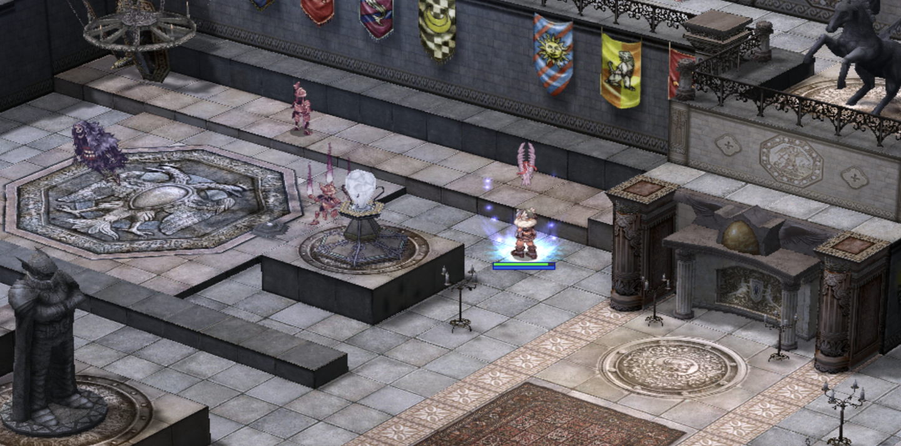

# 🎉 **Patch Notes - 6 December, 2024**

---

## 🎃 **Fall/Halloween Event End**

- The **Fall/Halloween Event** has officially concluded!
  - All event-related NPCs have been removed.
  - **Pumpkin Pie** no longer restores HP/SP.

> ⚠️ **Important:** Any leftover **Pumpkin Pie** can still be sold to NPC vendors, but it no longer restores HP/SP.

---

## 🏰 **Old Glast Heim Release**

- The **Old Glast Heim** dungeon has been adapted from Renewal to a Pre-renewal state, featuring:
  - Multiple **mob and item tweaks**.
  - Simplified **mechanics** for easier farming.
- Entrance and related NPCs are located just outside Glast Heim Castle steps:
  - **Map:** `glast_01`
  - **Coordinates:** `204,273`
- **Open-world** map variations were adapted to simplify mechanics vs traditional **Instance** style dungeon.

> 💡 **Tip:** Visit the NPCs near the entrance for detailed information on **new item exchanges**.

---

## 🔥 **Endless Cellar Adjustments**

- **Mechanics reverted:** Weekly cooldowns are now account-based.
- **Rewards:**
  - **Loot** and **EXP** are granted upon mob kills.
  - Dungeon timer set to **4 hours** from the time of entry.
- **Lockout Mechanism:**
  - Activated if no party members remain in the dungeon.
  - Lockout duration: **7-day reset** (party-based, not global).

> ⚠️ **Note:** Mobs remain confined to their respective levels.

---

## ⚔️ **Battlegrounds Rework**

- File structure reworked for **smoother gameplay**.
- All **5 Battleground Modes** reopened!  
  *(The 6th mode is currently in development and expected soon!)*
- **Cart Termination** skill cost reduced to `0 Zeny`.
- **Non-BG food items** now persist across all modes.

> ℹ️ **Update:** Improvements have also been made to reduce BG queue system delays.

---

## 🛠️ **Quality of Life Updates**

### **Expanded Kafra Services**

The following areas now have Kafra NPCs offering:
- **Guild Storage** access.
- **One-way transportation** to Prontera for `25,000z`.

**Areas Updated:**
- Ayothaya, Amatsu, Einbroch, Hugel, Gonryun, Lighthalzen, Louyang, Lutie, Moscovia, Rachel, Veins.

### **Additional Changes**
- **Barricade Repair Kit (#14287):** Now available from **Lydia** in the Main Office for `75 PC`.
- **Ninja Ammo Adjustments:** Cost and weight rebalanced for fairer gameplay.
- **Continental Messenger Quest:** NPCs no longer force proximity-based pop-ups.
- **Aliot Skill Adjustment:** Reduced **NPC_REBIRTH** chance from **20% → 10%** upon death.

> 💡 **Tip:** Warpra NPCs in **Payon** and **Ayothaya Dungeon** have been relocated for convenience.

---

## 🐾 **Pet Changes**

| Pet Name       | Updates                                                  |
|----------------|----------------------------------------------------------|
| **Orc Hero**   | Now grants **40/50 ATK** at Cordial/Loyal (was batk%).   |
| **Ghost Coffin** | Taming Item added to:                                   |
|                | - **Taming Gift Set**.                                   |
|                | - **Ghostring** drops at 6%.                             |
| **Whisper**    | Tame rate: **5%**.                                        |
| **Autofeed Enabled**   | **Picky** and **Whisper** and **New Year Doll** Pets.              |

---

## ⚔️ **WoE Adjustments**

- **Mardol Castle** (`arug_cas01`):
  - Now part of **Wednesday WoE** at **13:00 Server Time**.
- **Aldebaran Castle** (`aldeg_cas04`):
  - Removed random spawn script from the uppermost pre-emp portal.

---

## 🎯 **Extended Class Skill Reworks**

### **Gunslinger**
| Skill Name         | Change                                |
|--------------------|---------------------------------------|
| Rapid Shot         | SP cost per level 1–10: `12–20`.     |
|                    | AfterCastDelay: `1 sec → 0.75 sec`.  |
| Full Buster        | AfterCastDelay: `2 sec`.             |
|                    | SP cost level 5–10: `35`.            |
| Triple Action      | SP cost: `20 → 12`.                  |
| Flip the Coin      | SP cost: `2 → 1`. Success Rate: `100%`.

### **Ninja**
| Skill Name              | Change                                |
|-------------------------|---------------------------------------|
| Throw Zeny              | AfterCastDelay: `5 sec → 2 sec`.     |
|                         | SP cost: `50 → 25`.                  |
| Throw Kunai             | AfterCastDelay: `1 sec → 0.5 sec`.   |
| Final Strike            | SP cost per level 1–10: `30–50`.     |
| Throw Huuma Shuriken    | AfterCastDelay: `2 sec → 1.5 sec`.   |
|                         | SP cost level 1–5: `5,10,15,20`.     |

### **Star Gladiator**
- **Miracle Success Rate:** `0.02% → 0.1%`.

### **Soul Linker**
- **Esma SP Cost:** Level 1–10: `4–40`.

---

## 🎉 **Event NPC Exchanger Live**

- A new **Event NPC** is live in the **Main Office**!
  - Exchange **Event Tokens** from staff-led events for exciting prizes.
  - Not all events will reward tokens.
  - Items in the NPC rotate periodically.

> ⚠️ **Note:** Keep an eye on announcements for updates to the NPC's offerings.

---

## 📊 **Merchant Listings on CP**

- **Table formatting updated** for better readability.
- Implemented **monitoring controls** for real-time issue detection.

> ℹ️ **Reminder:** We're continuously working to improve the merchant listing system. Thank you for your patience!
